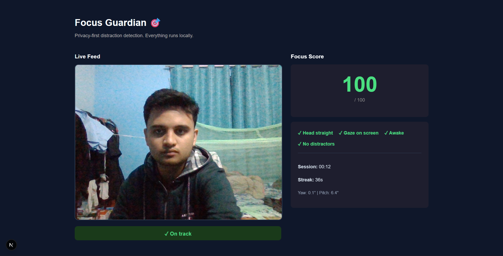
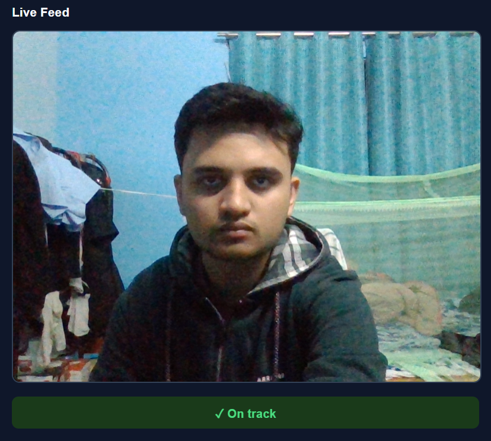
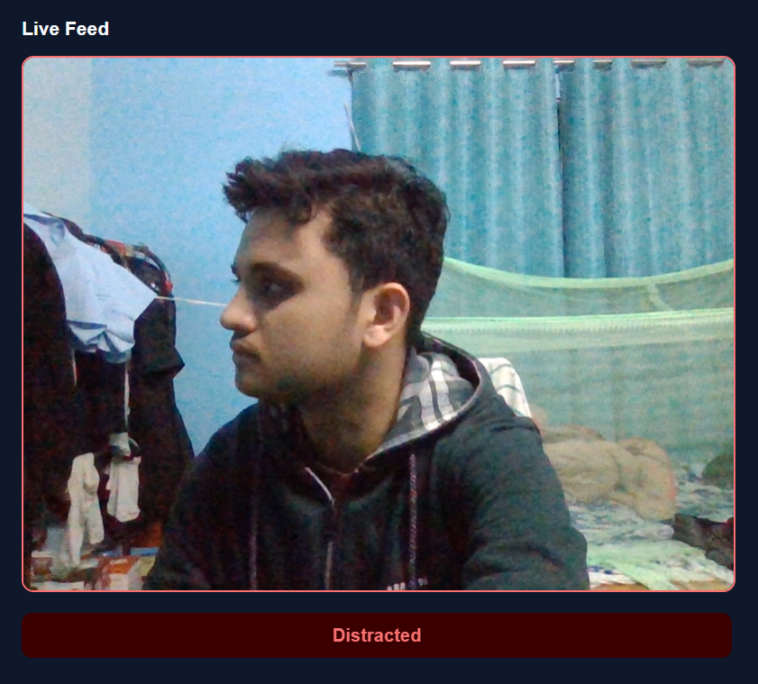
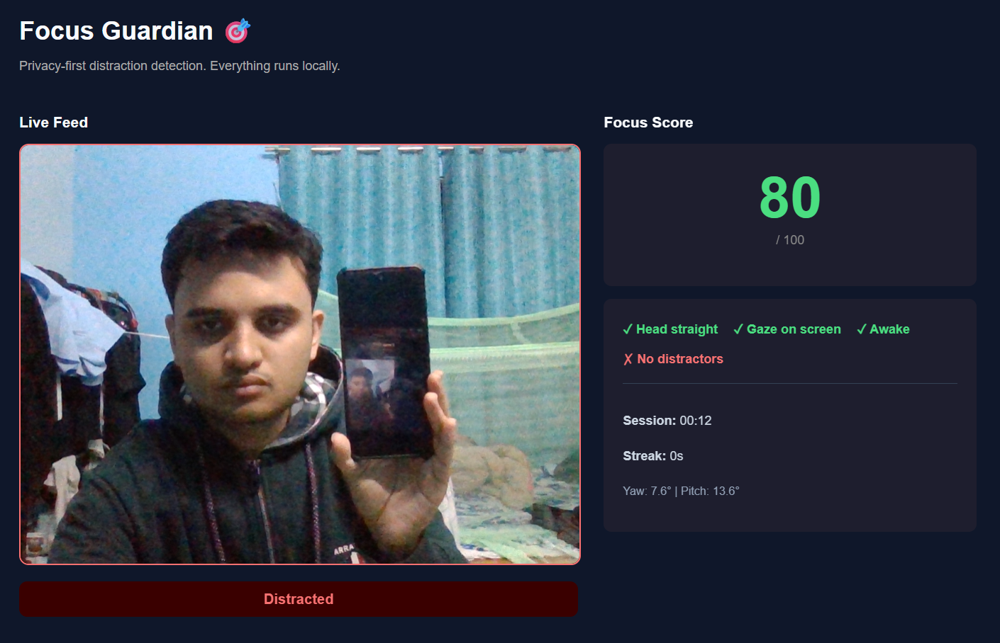

# 🎯 Focus Guardian

> **Privacy-first, AI-powered focus tracking for students and remote workers — 100% local inference, zero cloud uploads.**

[](https://www.python.org/)
[](https://nextjs.org/)
[](https://fastapi.tiangolo.com/)
[](https://mediapipe.dev/)
[](https://ultralytics.com/)
[](LICENSE)

---

## 📖 Table of Contents

- [Overview](#overview)
- [Key Features](#key-features)
- [How It Works](#how-it-works)
- [Tech Stack](#tech-stack)
- [Project Structure](#project-structure)
- [Getting Started](#getting-started)
  - [Prerequisites](#prerequisites)
  - [Backend Setup](#backend-setup)
  - [Frontend Setup](#frontend-setup)
- [Usage](#usage)
- [Privacy Guarantee](#privacy-guarantee)
- [Contributing](#contributing)
- [License](#license)

---

## Overview

Focus Guardian is a real-time, AI-powered desktop proctoring and attention-tracking application. It monitors your focus during study sessions or deep work, detects signs of distraction, and gently nudges you back on track — all without ever sending your video data to the cloud.

Whether you're a student preparing for exams or a remote worker trying to stay in flow, Focus Guardian acts as your personal productivity co-pilot: silent when you're focused, helpful when you drift.

<!-- 📸 SCREENSHOT: Full dashboard view showing the Focus Score, session timer, and streak counter -->


---

## Key Features

### 🧠 3D Head Pose Estimation
Uses advanced facial landmarking via **MediaPipe** and OpenCV's `solvePnP` to calculate your head's **Yaw**, **Pitch**, and **Roll** in real time. The geometry is carefully calibrated using nose, chin, and eye anchor points, so natural facial expressions like smiling don't trigger false distraction alerts.

### 👁️ Drowsiness & Gaze Tracking
Continuously monitors the **Eye Aspect Ratio (EAR)** to detect signs of sleepiness. Iris placement tracking ensures you're actually looking at your screen rather than zoning out.

### 📱 YOLOv8 Phone Detection
Leverages **Ultralytics YOLOv8** object detection to scan your environment for cell phones held in front of the camera — one of the most common study distractors.

### 📊 Dynamic Focus Score (0–100)
A proprietary scoring algorithm maintains a live Focus Score that drains when you look away or pick up your phone, and gradually recovers as you regain focus.

### 🎮 Gamified Real-Time Dashboard
Built in **Next.js**, the live dashboard shows:
- Current **Focus Score** with live visual feedback
- Active **Focus Streak** timer
- **Session duration** tracker
- Instant **Red/Green alert banners** when distraction is detected
- **Audio nudges** via the Web Audio API if distraction persists beyond 5 seconds

<!-- 📸 SCREENSHOT: Side-by-side of the Green "Focused" banner vs the Red "Distracted" alert banner -->



---

## How It Works

```
Browser (Next.js)
    │
    │  Compressed JPEG frames @ ~10 FPS
    ▼
FastAPI Backend
    ├── MediaPipe Face Landmarker  →  468 facial points → Head pose, EAR, gaze
    └── YOLOv8 Object Detection    →  Phone detection in frame
    │
    │  JSON response: { distraction_type, focus_score, alerts }
    ▼
React Hooks
    ├── Update Focus Score
    ├── Trigger visual banners (Red / Green)
    └── Fire audio nudge (Web Audio API) if distracted > 5 seconds
```

The Next.js frontend captures your webcam feed and sends aggressively compressed JPEG frames to the FastAPI backend at approximately 10 FPS. The backend routes each frame through MediaPipe and YOLO sequentially and returns a lightweight JSON payload describing your current focus state. The React frontend interprets the response and instantly updates the UI — no page reload, no lag.


---

## Tech Stack

### Frontend

| Technology | Purpose |
|---|---|
| Next.js & React | Live dashboard and real-time UI |
| HTML5 Media API | Webcam frame capture and streaming |
| Web Audio API | Local audio nudges for distraction alerts |

### Backend

| Technology | Purpose |
|---|---|
| FastAPI | Async Python server handling incoming video frames |
| Google MediaPipe | Face Landmarker — maps 468 facial points per frame |
| Ultralytics YOLOv8 | Spatial distractor detection (cell phone recognition) |
| OpenCV (`opencv-python-headless`) | Image array manipulation and 3D geometric calculations |

---

## Project Structure

```
focus-guardian/
├── backend/
│   ├── main.py               # FastAPI app and frame routing
│   ├── pose_estimator.py     # Head pose (solvePnP), EAR, gaze logic
│   ├── phone_detector.py     # YOLOv8 phone detection
│   ├── focus_score.py        # Dynamic Focus Score algorithm
│   └── requirements.txt
│
├── frontend/
│   ├── app/
│   │   ├── page.tsx          # Main dashboard
│   │   └── components/
│   │       ├── FocusScore.tsx
│   │       ├── AlertBanner.tsx
│   │       └── SessionTimer.tsx
│   ├── hooks/
│   │   └── useFocusStream.ts # Webcam capture + backend polling
│   └── package.json
│
└── README.md
```

---

## Getting Started

### Prerequisites

- **Python** 3.10 or higher
- **Node.js** 18 or higher
- A system webcam
- *(Optional but recommended)* A CUDA-capable GPU for faster YOLO inference

---

### Backend Setup

```bash
# 1. Clone the repository
git clone https://github.com/your-username/focus-guardian.git
cd focus-guardian/backend

# 2. Create and activate a virtual environment
python -m venv venv
source venv/bin/activate        # Windows: venv\Scripts\activate

# 3. Install dependencies
pip install -r requirements.txt

# 4. Start the FastAPI server
uvicorn main:app --host 0.0.0.0 --port 8000 --reload
```

The backend will be available at `http://localhost:8000`.

---

### Frontend Setup

```bash
# From the project root
cd frontend

# 1. Install dependencies
npm install

# 2. Start the development server
npm run dev
```

The dashboard will be available at `http://localhost:3000`.

> **Note:** Make sure the backend server is running before opening the frontend, as the dashboard begins streaming frames on load.

---

## Usage

1. Open `http://localhost:3000` in your browser.
2. Grant camera access when prompted.
3. Click **Start Session** to begin focus tracking.
4. Work normally — Focus Guardian runs silently in the background.
5. If you look away, get drowsy, or pick up your phone, you'll receive an instant on-screen alert and an audio nudge (after 5 seconds of sustained distraction).
6. Review your session summary — streak duration, average focus score, and distraction events — at the end of each session.


---

## Privacy Guarantee

**No video data ever leaves your machine.**

- All webcam frames are processed **locally** by the FastAPI backend running on your own hardware.
- Only a minimal JSON payload (focus state, score, distraction type) is exchanged between the backend and the browser — never raw video.
- No accounts, no telemetry, no cloud inference pipelines.

Focus Guardian is built on the principle that attention data is personal data. Your sessions are yours.

---

## Contributing

Contributions are welcome! If you'd like to fix a bug, add a feature, or improve the documentation:

1. Fork the repository
2. Create a feature branch: `git checkout -b feature/your-feature-name`
3. Commit your changes: `git commit -m 'Add your feature'`
4. Push to the branch: `git push origin feature/your-feature-name`
5. Open a Pull Request

Please open an issue first for major changes so we can discuss the approach.

---

## License

This project is licensed under the [MIT License](LICENSE).

---

<p align="center">Built with 🧠 for anyone who needs a little help staying in the zone.</p>
